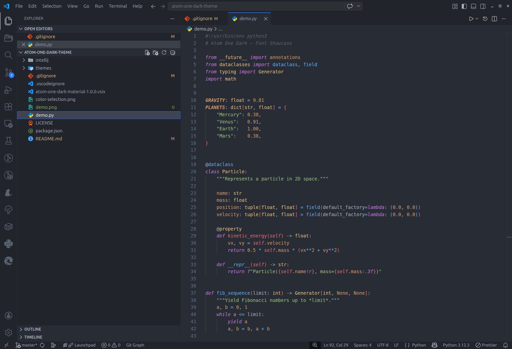

# Atom One Dark (Material) for VS Code


A faithful port of the **Atom One Dark** color scheme from the [IntelliJ Material Theme](https://plugins.jetbrains.com/plugin/8006-material-theme-ui) plugin — editor colors, UI chrome, terminal palette, git decorations and semantic highlighting all calibrated to match the IntelliJ experience.



---

## Color Palette

| Role | Hex |
|---|---|
| Background | `#282c34` |
| Active line | `#2c323c` |
| Selection | `#3e4451` |
| Foreground | `#abb2bf` |
| Comments | `#59626f` |
| Keywords | `#c679dd` |
| Strings | `#98c379` |
| Numbers / constants | `#d19a66` |
| Functions / methods | `#61aeef` |
| Class names | `#e5c17c` |
| Interfaces / abstract | `#98c379` |
| Instance fields | `#e06c75` |
| Operators | `#61afef` |
| Types / class refs | `#c679dd` |
| Parameters | `#abb2bf` |
| Accent / UI highlight | `#2979ff` |

---

## Features

- **Full UI theming** — title bar, activity bar, sidebar, status bar, tabs, panels and menus all styled to match IntelliJ One Dark.
- **Rainbow bracket highlighting** — six-level bracket colours (`#e06c75` → `#61afef` → `#c679dd` → `#98c379` → `#e5c17c` → `#d19a66`) mirroring IntelliJ's rainbow brackets feature.
- **Semantic highlighting** — classes, interfaces, enums, functions, methods, properties, parameters, variables, macros and labels are all coloured semantically, with the same italic/bold modifiers as IntelliJ.
- **Language coverage** — JavaScript / TypeScript, Python, Java, Go, Rust, CSS / SCSS, HTML, JSON, Markdown, Shell, Elixir and more.
- **Terminal palette** — ANSI 16-colour palette matches the IntelliJ embedded terminal.
- **Git decorations** — added, modified, deleted, renamed, untracked, ignored and conflicting files use the exact colours from IntelliJ's VCS file-status palette.
- **Peek / Find-usages panel** — background, selection and match-highlight colours match IntelliJ's popup and tool-window style.
- **Autocomplete widget** — suggest dropdown uses the IntelliJ lookup popup colour (`#2F333D`).
- **Debug integration** — stack-frame and focused-stack-frame highlight backgrounds from IntelliJ's debug execution-point colours.
- **Inlay hints** — foreground `#979fad` on background `#21252b`, matching IntelliJ's inlay hint style.
- **Diff editor** — inserted/deleted line backgrounds taken directly from IntelliJ's diff view colours.

---

## Building the VSIX

Install the VS Code Extension Manager if you don't have it:

```bash
npm install -g @vscode/vsce
```

Then package the extension from the repo root:

```bash
vsce package
```

This produces `atom-one-dark-material-<version>.vsix` in the current directory.

---

## Installation

**From a VSIX file:**
```bash
code --install-extension atom-one-dark-material-1.0.0.vsix
```

**Via the Extensions panel:**  
`Extensions` → `⋯` → `Install from VSIX…`

**Activate the theme:**  
`Ctrl+K Ctrl+T` → select **Atom One Dark (Material)**

---

## Recommended Settings

To best reproduce the IntelliJ feel, add the following to your `settings.json`:

```jsonc
{
  "editor.fontFamily": "JetBrains Mono, Menlo, monospace",
  "editor.fontSize": 13,
  "editor.lineHeight": 1.4,
  "editor.fontLigatures": true,
  "editor.semanticHighlighting.enabled": true,
  "editor.bracketPairColorization.enabled": true,
  "editor.guides.bracketPairs": "active"
}
```

---

## Source

The colour values are derived from:

- `Atom One Dark.xml` — IntelliJ editor scheme  
- `onedark.theme.json` — IntelliJ Material Theme UI definitions

---

## License

MIT

## Notice

Extension icon by [Smashicons](https://www.flaticon.com/authors/smashicons) via [Flaticon](https://www.flaticon.com/free-icons/customize).
